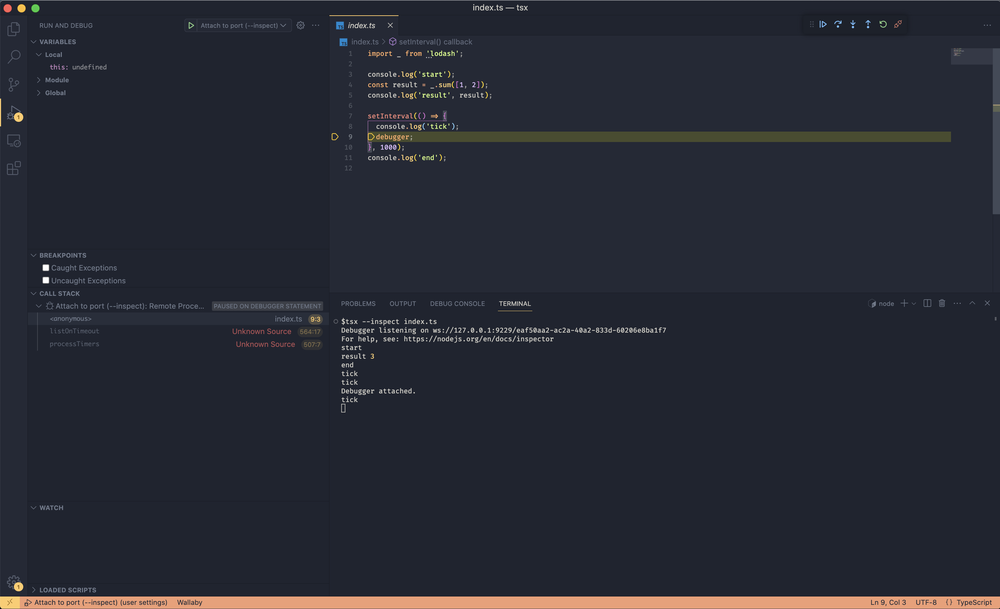
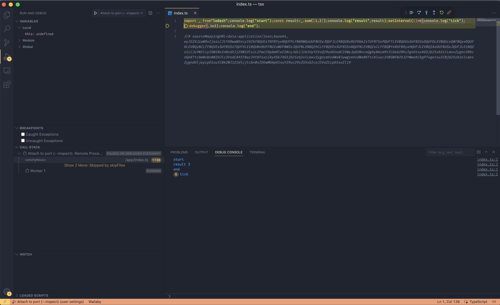

Run natively with debugger:
1. `tsx --inspect index.ts`
2. Attach debugger
3. Result:

Run inside container with debugger:
1. `docker build -t tsx-image . && docker run --rm -p 9229:9229 --name tsx tsx-image`
2. Attach debugger
3. Result:

